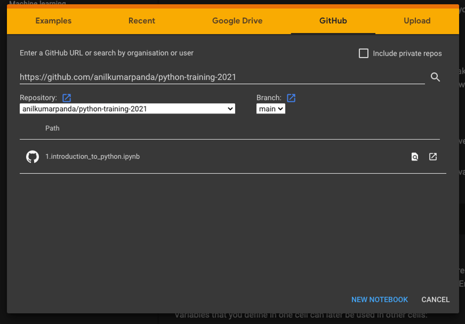

# Installation & Set-up

This training consists of two parts :
1. Python
2. Git

We will have a look at the installation for each of them :

## Python

In this training we will work with Google Collab. This is an online environment 
to run code without installation. To use google collab you just need a gmail account & internet access. 
Please create a gmail id before the training incase you don't have one.

A.	Using Google Collab :

1.	Go to https://colab.research.google.com/ .
2.	Signin with your personal gmail account. Please create one if not present.
3.	Under the GitHub tab search for the github repo :
https://github.com/anilkumarpanda/python-training-2021

.

4.	Click on 0.1_installation_check.ipynb notebook and get started.

B. However incase you want to install python on your own environment you can follow the following tutorials 
for installing Python with VS Code (my preferred editor). You can also use any other editor of you choice:

1. https://www.youtube.com/watch?v=T0O07hELcJc
2. [Enable ipython in VS Code](https://towardsdatascience.com/jupyter-notebook-in-visual-studio-code-3fc21a36fe43)

## Git

1. Take 10 minutes and read the [presentation git for humans](https://speakerdeck.com/alicebartlett/git-for-humans) . It will help you create some first intuition around the core concepts
2. On windows? Download & install https://gitforwindows.org/ . You cannot participate in this training without it
3. Create an account on github.com and share your username with me before (Thursday  21st Jan)

Looking forward, see you then!

