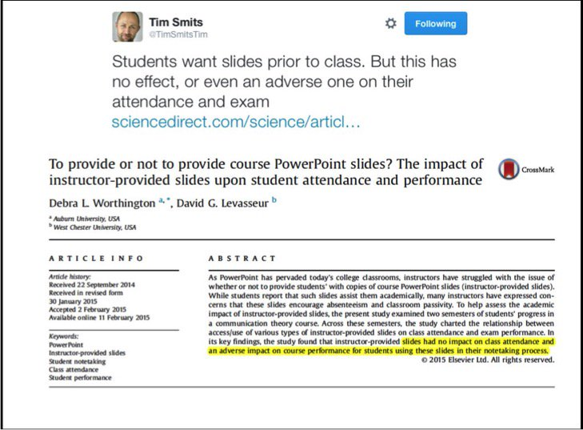
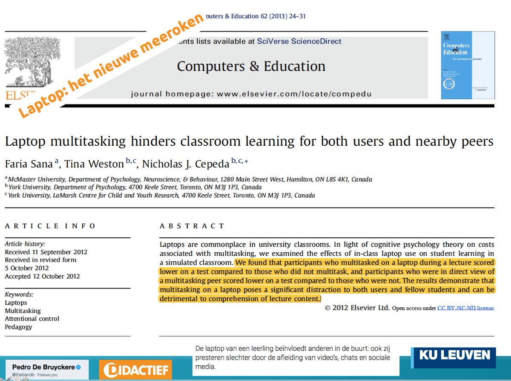

# Introduction to Python Training - 2021

The training will follow the following a 25-25-10 schedule.

For each hour :

    25 mins we will provide introduction to the topic.
    25 mins of hands on practice.
    10 mins break ( check email,grab a coffee etc)

For hands on, we will divide (randomly into breakout rooms) we will visit the break out rooms.

We will have a break from 12.00-1.00 .  However Dan & I will be back 15 mins ealrier to answer any questions.

Sequence of topics :

Day 1 :

1. Introduction & Setup (9.00 am - 10.00 am)
2. Introduction to Python (10.00 am - 2.00 pm)
3. Introduction to Pandas (2.00 pm - 4.00 pm)

Day 2 :

1. Introduction to Matplotlib (9.00 am - 11.00 am)
2. Practical things (11.00 am - 12.00 pm)
3. Git (1.00 pm - 4.00 pm)

Since this is an online training, we will try to keep it as interactive as possible.

.

.

.
